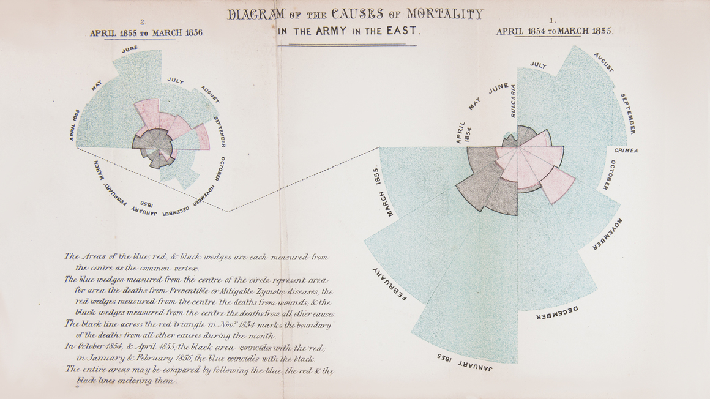
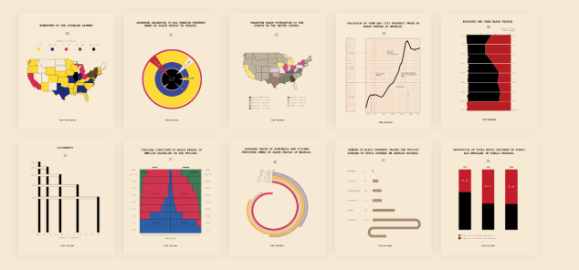
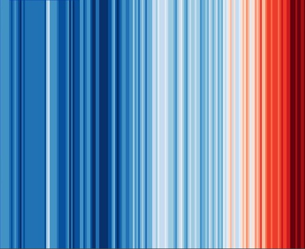

<link rel="stylesheet" href="./styles/styles.css">

# Quick Introduction to Data Viz

Data visualisation is one of the most powerful tools we have to understand the world and raise awareness about important issues. It is not about creating fancy charts. Encoding information onto visual elements can and has changed the world.

    

        
        <i>Thanks to 
            <a href = "https://www.scientificamerican.com/article/how-florence-nightingale-changed-data-visualization-forever/" target = "_blank">Florence Nightingale’s visualisations</a> about deaths during the Crimean War we learned the true importance of sanitation.
        </i>
    

    

        <i>If it weren’t for <a href = "https://www.theguardian.com/news/datablog/2013/mar/15/john-snow-cholera-map" target="_blank">John Snow’s visualisation</a> of cholera cases in London, we might still think the disease spreads through the air and many more people might have died.</i>
        
    

    

    
    <i><a href = "https://www.smithsonianmag.com/history/first-time-together-and-color-book-displays-web-du-bois-visionary-infographics-180970826/" target="_blank">W.E.B Du Bois’ iconic charts</a> played a significant role in advancing civil rights in the US and pointing out racial disparities.</i>
    

    

    <i>Ed Hawkins’ <a href="https://showyourstripes.info/" target="_blank">climate stripes</a> have become a symbol of the climate crisis and have been used by many organisations to raise awareness about global warming.</i>
    
    

Charts and visuals are becoming more and more common in publications, and some are becoming iconic like those of the FT or the Economist. And for ONE's work, it can be a secret weapon to get people to care about what we stand for and make a real difference.

So, let's go make some beautiful and impactful charts…