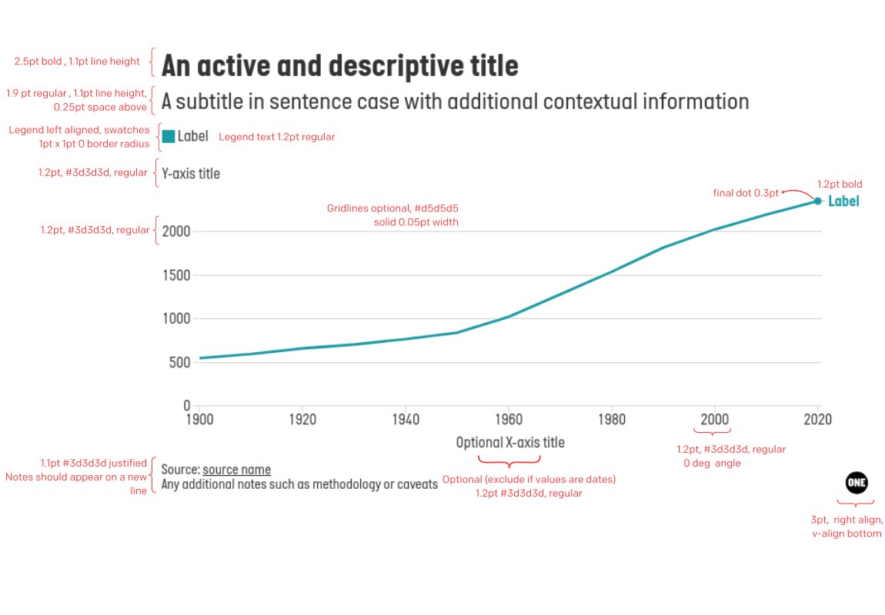

<link rel="stylesheet" href="./styles/styles.css">

# Layout

Different charts may require a specific layout, but for standard charts, the following layout should be used. If you are using the ONE Flourish editor to create your chart, the 
preset theme will automatically apply this styling.

